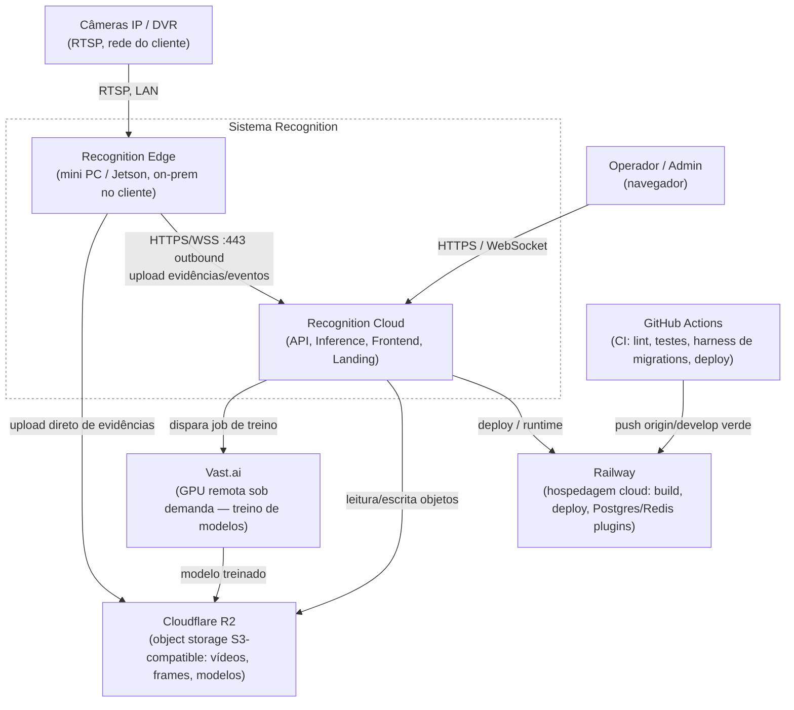

# Arquitetura — Recognition (Modelo C4, Nível 1 e 2)

> Não foi encontrada nenhuma referência a um board Miro (`miro.com`) em `docs/` neste
> repositório — este documento não replica um diagrama Miro existente; ele foi construído
> do zero a partir da estrutura real do repositório em `origin/develop`, verificada no
> commit `86ca800` ("Merge pull request #163 ... task-078 — containers/overlays
> transparentes"), datado de **2026-07-14**. Se um board Miro vier a ser adotado como
> fonte visual complementar, referencie-o aqui.

> **Nota sobre o CLAUDE.md do repositório:** a seção "Stack produção" do
> `CLAUDE.md` (raiz) descreve uma topologia de **13 serviços Railway** e reutiliza
> nomenclatura de uma geração anterior do projeto. A investigação abaixo (código,
> `requirements/*.txt`, workflows de CI/CD e `railway.toml` por serviço) mostra uma
> estrutura de monorepo (`services/` + `apps/`) diferente da descrita ali. Este documento
> reflete o que foi **verificado no código**, não o texto do CLAUDE.md.

## Nível 1 — Contexto



**Atores e sistemas externos (verificados):**
- **Operador/Admin**: usuário autenticado (JWT) que acessa o dashboard React em `apps/frontend`.
- **Câmeras IP/DVR**: fontes RTSP no site do cliente; hoje ingeridas via lógica de
  `camera-gateway` embutida em `services/api/app/api/v1/cameras/` (`stream_handlers.py`,
  `local_stream_manager.py`) — não é (ainda) um serviço Railway separado.
- **Recognition Edge**: mini PC / device Jetson on-prem (ver `services/edge-sync-agent/`
  e ADR-0040). Ligação outbound-only por WSS/HTTPS, sem portas de entrada
  (`docs/architecture/EDGE_AGENT_ARCHITECTURE.md`).
- **Railway**: plataforma de deploy usada pela cloud (Postgres e Redis como plugins
  gerenciados; cada serviço com seu próprio `railway.toml`).
- **Cloudflare R2**: storage S3-compatible via `boto3` (`requirements/base.txt`), usado
  pela API (`services/api/app/infrastructure/storage/r2_storage.py`) e pelo
  pré-anotador para baixar checkpoints (`R2_ENDPOINT`/`R2_BUCKET` em `railway_start.py`).
- **Vast.ai**: GPU remota sob demanda para treino (`training/vast/remote_train.py`,
  `provision_and_train.sh`), coberto por teste dedicado no CI
  (`training/vast/test_remote_train.py`).
- **GitHub Actions**: `.github/workflows/ci.yml` (lint, testes, harness de migrations,
  testes de frontend) e `.github/workflows/railway-deploy-dev.yml` (deploy automático
  para o ambiente Railway "Desenvolvimento" após CI verde em `develop`).

## Nível 2 — Contêineres

```mermaid
flowchart TB
    subgraph client["Navegador do usuário"]
        browser["SPA React"]
    end

    subgraph railwaycloud["Railway — ambiente cloud"]
        api["services/api\nFlask + gunicorn + gevent-websocket\nSERVICE_TYPE=api"]
        worker["services/api (mesmo código)\nCelery Worker\nSERVICE_TYPE=worker/celery-worker"]
        beat["services/api (mesmo código)\nCelery Beat (réplica única)\nSERVICE_TYPE=beat"]
        inference["services/inference\nMotor YOLO (Ultralytics ou DeepStream)\nconsumidor Redis pub/sub"]
        preannot["pre-annotation-service\nFlask/gunicorn — DINO + SAM\npré-anotação assistida"]
        frontend["apps/frontend\nReact 18 + TypeScript + Vite\nzustand, react-query, socket.io-client"]
        landing["apps/landing\nAstro 4 + React\nonnxruntime-web (demo YOLO no browser)"]
        postgres[("PostgreSQL 15 (+pgvector)\ninfra/migrations/*.sql\npsycopg2 direto, sem ORM")]
        redis[("Redis 7\npub/sub de frames/detecções,\nbroker Celery, cache")]
    end

    r2out[("Cloudflare R2\nvídeos, frames, checkpoints,\nmodelos treinados")]
    vastout["Vast.ai\nGPU remota (RF-DETR / YOLOX)"]

    subgraph edgebox["Cliente — mini PC / Jetson (on-prem)"]
        edgeagent["services/edge-sync-agent\nPython — MQTT consumer, SQLite WAL buffer,\nuploader, config/command poller, mirror API"]
        deepstream["deepstream/\nDeepStream + VST + DLA\n(proposto, ADR-0040 'Status: Proposta')"]
    end

    browser -->|HTTP/JSON /api/v1/*| api
    browser -->|WebSocket| api
    frontend -.->|build servido como SPA| browser
    landing -.->|site estático + ONNX no browser| browser

    api --> postgres
    api --> redis
    api -->|boto3| r2out
    worker --> postgres
    worker --> redis
    worker -->|filas: extraction, quality, versioning,\ninference, training, reports, quality_cep| redis
    beat -->|agenda tasks seguras\n(compliance, CEP, shift-reports, drift)| redis

    inference -->|psubscribe frame:*| redis
    inference -->|publish det:{camera_id}| redis
    inference --> r2out

    preannot -->|checkpoints DINO/SAM| r2out
    preannot --> postgres

    worker -->|dispatch remoto| vastout
    vastout --> r2out

    edgeagent -->|MQTT local :1883| deepstream
    edgeagent -->|HTTPS/WSS :443 outbound| api
    edgeagent -->|upload direto evidências| r2out
```

## Contêineres — detalhamento

**`services/api`** — Flask + `flask-socketio` + `gunicorn` (worker class
`GeventWebSocketWorker` quando `gevent`/`gevent-websocket` disponíveis, senão `sync`).
Roteado por `SERVICE_TYPE` em `railway_start.py` (raiz) para três papéis a partir do
**mesmo código-fonte** (`services/api/app/`): API HTTP+WS (`api`), Celery Worker
(`worker`/`celery-worker`, filas `extraction, quality, versioning, inference, training,
reports, quality_cep`) e Celery Beat singleton (`beat`, agenda apenas o
`SAFE_BEAT_SCHEDULE`). Build via `services/api/Dockerfile` (API, sem torch) e
`services/api/Dockerfile.worker` (worker, com `torch`/`onnxruntime`/`opencv`), ambos com
`rootDirectory`/build-context na raiz do repo. Fala com Postgres (`psycopg2`, sem ORM,
`RealDictCursor`), Redis (broker Celery + pub/sub) e R2 (`boto3`).

**`services/inference`** — motor de inferência YOLO em tempo real, desacoplado da API.
Assina frames publicados no Redis (`frame:*`) e publica detecções (`det:{camera_id}`).
Dois backends: `ultralytics` (padrão hoje, CPU/GPU) e `deepstream` (planejado para o
edge Jetson, ADR-0040). Deploy próprio via `services/inference/Dockerfile` +
`railway.toml` (`rootDirectory = services/inference`).

**`services/edge-sync-agent`** — agente Python on-prem no site do cliente. Marcado como
"Status: Placeholder — implementação na Fase 4" no seu `SDD.md`, mas já tem módulos
implementados (`mqtt_consumer`, `sqlite_buffer` como WAL local, `uploader`,
`config_poller`, `command_poller`, `heartbeat`, `mirror_api`). Consome eventos do
Mosquitto MQTT local e sincroniza com a cloud via HTTPS/WSS outbound-only.

**`pre-annotation-service`** — serviço Flask/gunicorn independente (DINO + SAM) para
pré-anotação assistida de datasets. Tem `Dockerfile`/`railway.toml` próprios; também
pode subir via `SERVICE_TYPE=pre-annotation` do `railway_start.py` legado, que instala
dependências pesadas (torch, groundingdino) em runtime e baixa checkpoints do R2.

**`apps/frontend`** — SPA React 18 + TypeScript + Vite (`vite.config.ts` com
`usePolling: true` e `cacheDir: /tmp/vite-cache-epi`, exigido pelo caminho com espaço do
repo). Stack: `zustand`, `@tanstack/react-query`, `socket.io-client`, `hls.js`, Radix UI.
Testado no CI com `vitest` (unit) e `playwright` (E2E smoke).

**`apps/landing`** — site institucional Astro 4 + React, com demo de detecção YOLO
rodando **inteiramente no navegador** via `onnxruntime-web` (sem chamada ao backend).

**PostgreSQL 15 (+pgvector)** — schema em `infra/migrations/*.sql` (101 migrations na
verificação, até `101_model_eval_drift.sql`, mais `run_migrations.py`), aplicado
automaticamente no boot do serviço `api`. CI valida idempotência num harness dedicado
(`tests/harness/migrations/`, job `migrations-harness`, imagem `pgvector/pgvector:pg15`).

**Redis 7** — broker Celery, canal pub/sub de frames/detecções entre `inference` e
`api` (via `socket_bridge`), e cache.

**Cloudflare R2** — storage de objetos S3-compatible (vídeos, frames, datasets,
checkpoints, modelos treinados), acessado via `boto3`.

**Vast.ai** — GPU remota sob demanda para treino de `RF-DETR`/`YOLOX`
(`training/vast/train_rfdetr.py`, `train_yolox.py`, `remote_train.py`,
`provision_and_train.sh`), disparada pelo worker; CI cobre a acumulação de métricas por
época com um fake mínimo (`test_remote_train.py`), sem instalar torch/ML no runner.

**`deployments/edge` e `deepstream/`** — placeholders/spike de referência para o
roadmap de edge Jetson (ADR-0040, "Status: Proposta"): DeepStream, VST e DLA. Ainda não
substituem o `camera-gateway` embutido em `services/api` nem o `edge-sync-agent` atual.

**Artefatos legados** (fora do caminho de deploy atual): `railway_start.py` e
`nixpacks.toml` na raiz ainda referenciam um diretório `backend/` e `landing-page/` que
não existem mais neste checkout (substituídos por `services/api/` e `apps/landing/`);
os builds reais usam `Dockerfile`/`railway.toml` por serviço. Há também um
`nixpacks-disabled.toml`, reforçando que o caminho Nixpacks está desativado.

## Evidência de deploy real (CI/CD)

`ci.yml` roda: `ruff check services/api/`; `pytest services/api/tests/` (cobertura
mínima 60%, `requirements/api.txt`, sem ML); `pytest pre-annotation-service/tests/`;
`pytest training/vast/test_remote_train.py`; `tsc --noEmit` + `vitest`/`playwright` em
`apps/frontend/`; harness de idempotência contra `infra/migrations/`.
`railway-deploy-dev.yml` dispara, após CI verde em `develop`, `railway up --service
"API-V3"` e `railway up --service "frontend"` no ambiente "Desenvolvimento" — evidência
direta de pipeline automatizado para esses dois; os demais (`inference`,
`pre-annotation-service`, `edge-sync-agent`) são publicados manualmente via Railway CLI.

## Fontes

`ls` na raiz/`services/`/`apps/`/`infra/`/`training/`/`requirements/`/`docs/`; `git log
-1` (commit `86ca800`, 2026-07-14); `.github/workflows/ci.yml` e
`railway-deploy-dev.yml`; `railway_start.py` + `nixpacks.toml`/`nixpacks-disabled.toml`
(raiz); `requirements/{base,api,worker,celery-worker,inference}.txt`;
`services/api/{Dockerfile,Dockerfile.worker,railway.toml}`;
`services/inference/{Dockerfile,railway.toml,SDD.md}`;
`services/edge-sync-agent/{SDD.md,app/}`;
`pre-annotation-service/{Dockerfile,railway.toml}`;
`apps/frontend/{package.json,vite.config.ts}`; `apps/landing/package.json`;
`services/api/app/infrastructure/storage/r2_storage.py`; listagem de
`infra/migrations/` (até `101_model_eval_drift.sql`);
`docs/decisions/adr/0040-edge-ancorado-jetson-platform-services.md`;
`docs/architecture/EDGE_AGENT_ARCHITECTURE.md`; `training/vast/`; busca por `miro.com`
em `docs/` (sem resultados).
